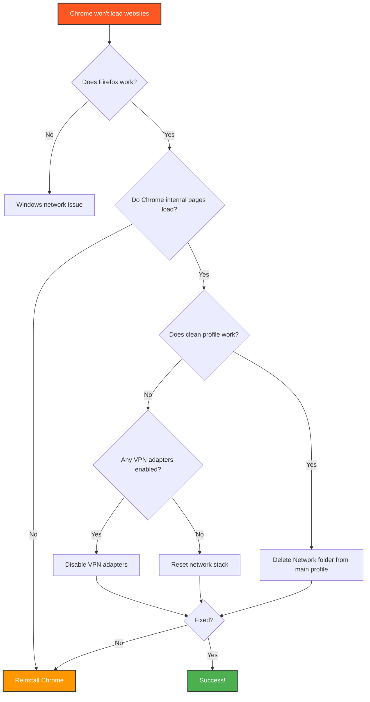

<div align="center">

```
 ██████╗██╗  ██╗██████╗  ██████╗ ███╗   ███╗███████╗    ███████╗██╗██╗  ██╗
██╔════╝██║  ██║██╔══██╗██╔═══██╗████╗ ████║██╔════╝    ██╔════╝██║╚██╗██╔╝
██║     ███████║██████╔╝██║   ██║██╔████╔██║█████╗      █████╗  ██║ ╚███╔╝ 
██║     ██╔══██║██╔══██╗██║   ██║██║╚██╔╝██║██╔══╝      ██╔══╝  ██║ ██╔██╗ 
╚██████╗██║  ██║██║  ██║╚██████╔╝██║ ╚═╝ ██║███████╗    ██║     ██║██╔╝ ██╗
 ╚═════╝╚═╝  ╚═╝╚═╝  ╚═╝ ╚═════╝ ╚═╝     ╚═╝╚══════╝    ╚═╝     ╚═╝╚═╝  ╚═╝
```

# 🔥 The Cyra Protocol 🔥
## *Fixing Chrome When Internet Works But Chrome Doesn't*


### ⚡ *When everything works except the one thing you need most* ⚡

**Documented during the legendary Cyra Chrome Meltdown of 2025**

---

</div>

## 🚨 The Nightmare Scenario

You're sitting at your computer. Everything seems fine. WhatsApp works. Discord works. Your internet is clearly connected. You can ping Google. Firefox loads websites perfectly.

**But Chrome?** Chrome is dead. Every page times out. Even typing `1.1.1.1` directly doesn't work.

```
ERR_CONNECTION_TIMED_OUT
ERR_NETWORK_CHANGED
This site can't be reached
```

You've checked everything. DNS is fine. Proxy settings are clean. Firewall isn't blocking anything. Windows says your network is perfect. But Chrome refuses to connect to anything.

**Welcome to the Cyra Protocol.** This is your survival guide.

---

## ❌ Symptoms Checklist

<table>
<tr>
<td width="50%">

### ✅ What WORKS:
- ✔️ Internet connection active
- ✔️ WiFi/Ethernet connected
- ✔️ WhatsApp Desktop loads
- ✔️ Discord works fine
- ✔️ Firefox loads websites
- ✔️ `ping 8.8.8.8` succeeds
- ✔️ Other apps connect normally
- ✔️ Windows Network Diagnostics: "No problems found"

</td>
<td width="50%">

### ❌ What DOESN'T WORK:
- ❌ Chrome won't load ANY website
- ❌ Edge (Chromium) also broken
- ❌ Even IP addresses fail (1.1.1.1)
- ❌ `ERR_CONNECTION_TIMED_OUT`
- ❌ `ERR_NETWORK_CHANGED`
- ❌ Chrome internal pages load but network doesn't
- ❌ Incognito mode doesn't help
- ❌ All websites timeout after 30 seconds

</td>
</tr>
</table>

---

## 🔍 Root Cause Analysis

<div align="center">

### 🎯 **The Real Culprit**

</div>

This isn't a Windows networking issue. This isn't DNS. This isn't your router.

**The problem is:**

1. **Corrupted Chrome Profile Network Folder** — Chrome stores network state, sockets, and cache in your user profile. When this gets corrupted, Chrome's internal network service breaks while Windows networking remains fine.

2. **Leftover VPN/TUN Drivers** — Virtual network adapters from VPNs (Windscribe, Wintun, TAP) can hijack Chrome's network routing even after the VPN is uninstalled.

**Why Firefox works:** Firefox uses Windows networking directly. Chrome/Edge use Chromium's network stack, which maintains its own state and routing separate from Windows.

---

## 🧪 Fast Diagnosis (5 Minutes)

Before diving into fixes, confirm this is actually a Chrome-specific issue:

### Step 1: Test Other Browsers

```bash
# Try Firefox or another non-Chromium browser
# If it works → Problem is Chrome-specific
```

### Step 2: Test Basic Connectivity

```cmd
# Open Command Prompt and run:
ping 8.8.8.8
ping google.com

# If these work → Internet is fine, Chrome is broken
```

### Step 3: Test Chrome Internals

Open Chrome and try these URLs:

```
chrome://net-internals/#dns
chrome://net-internals/#sockets
chrome://settings/
```

<table>
<tr>
<td width="50%">

**✅ If these pages LOAD:**
Chrome itself is running fine. The browser works. Only the network connection is broken.

</td>
<td width="50%">

**❌ If these pages DON'T LOAD:**
Chrome is completely broken. Skip to full reinstall.

</td>
</tr>
</table>

### Step 4: Test With Clean Profile

```cmd
# Launch Chrome with a temporary profile:
chrome.exe --user-data-dir="C:\ChromeTest" --no-first-run
```

**If websites load in this clean profile** → Your main profile is corrupted. Proceed to Step 2 of the fix.

**If websites still don't load** → System-level issue. Check VPN adapters and network drivers.

---

## 🛠️ The Cyra Protocol: Complete Fix Procedure

<div align="center">

### ⚡ *Follow these steps in order* ⚡

</div>

---

### 🔧 **STEP 1: Kill All Chrome Processes**

Chrome can't be fixed while it's running.

```cmd
# Open Command Prompt as Administrator
taskkill /F /IM chrome.exe
taskkill /F /IM msedge.exe
```

**Verify:**
- Open Task Manager (`Ctrl + Shift + Esc`)
- Check that no Chrome or Edge processes remain

---

### 📂 **STEP 2: Delete Chrome Network Folder**

This is where Chrome stores corrupted network state.

**Location:**
```
C:\Users\{YourUsername}\AppData\Local\Google\Chrome\User Data\Default\Network\
```

**Instructions:**

1. Press `Win + R`
2. Type: `%LOCALAPPDATA%\Google\Chrome\User Data\Default`
3. Find the `Network` folder
4. **Rename it to** `Network_OLD` (don't delete yet, just in case)

<div align="center">

> ⚠️ **WARNING:** Do NOT delete the entire Default folder. Only rename the Network folder.

</div>

---

### 👤 **STEP 3: Create a New Chrome Profile**

Sometimes the entire profile is corrupted beyond just the Network folder.

**Option A: Rename Your Profile (Recommended)**

```
C:\Users\{YourUsername}\AppData\Local\Google\Chrome\User Data\

Rename:
Default → Default_OLD
```

When you launch Chrome, it will create a fresh `Default` profile.

**Option B: Use Profile Manager**

1. Open Chrome
2. Click your profile icon (top right)
3. Click "Add"
4. Create a new profile
5. Test if websites load

---

### 🔌 **STEP 4: Disable VPN Network Adapters**

Even if you uninstalled your VPN, ghost adapters can remain.

**Instructions:**

1. Press `Win + R`, type: `ncpa.cpl`
2. Look for adapters with these names:
   - Windscribe
   - WireGuard
   - Wintun
   - TAP-Windows
   - Any adapter with "VPN" or "Virtual" in the name
3. **Right-click → Disable** each one
4. Restart your computer

<div align="center">

```
┌─────────────────────────────────────┐
│  Network Connections                │
├─────────────────────────────────────┤
│  ✅ Ethernet                         │
│  ✅ WiFi                             │
│  ❌ Windscribe (Disabled)            │
│  ❌ TAP-Windows Adapter (Disabled)   │
│  ❌ Wintun Tunnel (Disabled)         │
└─────────────────────────────────────┘
```

</div>

---

### 🌐 **STEP 5: Reset Network Stack**

Clean out any system-level network corruption.

**Run these commands in Administrator Command Prompt:**

```cmd
# Reset WinHTTP proxy settings
netsh winhttp reset proxy

# Flush DNS cache
ipconfig /flushdns

# Reset Winsock
netsh winsock reset

# Reset TCP/IP stack
netsh int ip reset

# Reset Windows Firewall (optional)
netsh advfirewall reset

# Restart your computer
shutdown /r /t 0
```

---

### 🔥 **STEP 6: Nuclear Option — Complete Chrome Removal**

If nothing above worked, Chrome needs a complete reinstall.

**Uninstall Chrome:**

1. Press `Win + R`, type: `appwiz.cpl`
2. Find "Google Chrome"
3. Click "Uninstall"
4. Follow the prompts

**Delete ALL Chrome Data:**

```
C:\Program Files\Google\
C:\Program Files (x86)\Google\
%LOCALAPPDATA%\Google\Chrome\
%APPDATA%\Google\Chrome\
```

**Instructions:**

1. Press `Win + R`, type: `%LOCALAPPDATA%`
2. Delete the `Google` folder (or rename to `Google_OLD`)
3. Press `Win + R`, type: `%APPDATA%`
4. Delete the `Google` folder
5. Check `C:\Program Files\` and `C:\Program Files (x86)\`
6. Delete any remaining `Google` folders

---

### 📥 **STEP 7: Fresh Chrome Installation**

Download Chrome from a clean source:

1. Use Firefox to download: [https://www.google.com/chrome/](https://www.google.com/chrome/)
2. Run the installer
3. **DO NOT** sign in immediately
4. Test if websites load first
5. Once confirmed working, sign in to restore bookmarks/extensions

---

### 💾 **STEP 8: Restore Your Data**

**Bookmarks:**
- Sign in to Chrome with your Google account
- Bookmarks sync automatically
- Or import from Firefox/backup

**Extensions:**
- Reinstall from Chrome Web Store
- Check if any extensions were causing conflicts

**Passwords:**
- Should sync with Google account
- Or import from password manager

---

## ⚡ Quick Commands Reference

<table>
<tr>
<td width="50%">

### 🔧 Chrome Commands

```cmd
# Kill Chrome
taskkill /F /IM chrome.exe

# Launch clean profile
chrome.exe --user-data-dir="C:\Test"

# Clear Chrome DNS cache
chrome://net-internals/#dns
(Click "Clear host cache")

# Reset Chrome sockets
chrome://net-internals/#sockets
(Click "Flush socket pools")
```

</td>
<td width="50%">

### 🌐 Network Commands

```cmd
# Flush DNS
ipconfig /flushdns

# Reset WinHTTP proxy
netsh winhttp reset proxy

# Reset Winsock
netsh winsock reset

# Reset TCP/IP
netsh int ip reset

# Test connectivity
ping 8.8.8.8
ping google.com
```

</td>
</tr>
</table>

---

## 📊 Troubleshooting Flowchart



---

## 📁 Chrome User Data Structure

Understanding where Chrome stores its data:

```
📦 User Data/
┣ 📂 Default/                    ← Your main profile
┃ ┣ 📂 Network/                  ← 🔥 DELETE THIS to fix network issues
┃ ┣ 📂 Cache/
┃ ┣ 📂 Extensions/
┃ ┣ 📄 Bookmarks
┃ ┣ 📄 History
┃ ┗ 📄 Preferences
┣ 📂 Profile 1/                  ← Additional profiles
┣ 📂 Guest Profile/
┣ 📂 ShaderCache/
┗ 📄 Local State
```

---

## 💡 Lessons Learned

<table>
<tr>
<td>

### 🎓 What Went Wrong

- **Corrupted network state** in Chrome's profile folder
- **VPN adapters** interfering with Chromium's network stack
- **Windows networking was fine** — the issue was Chrome-specific
- **Profile corruption** can happen from crashes, forced shutdowns, or buggy extensions

</td>
</tr>
<tr>
<td>

### 🛡️ How to Prevent This

- ✅ **Close Chrome properly** — Don't force-close or kill processes unless necessary
- ✅ **Uninstall VPNs completely** — Use official uninstallers, not just deleting files
- ✅ **Disable adapters after VPN removal** — Check `ncpa.cpl` for ghost adapters
- ✅ **Back up bookmarks regularly** — Export to HTML or use Google sync
- ✅ **Test new extensions carefully** — Some can corrupt network settings
- ✅ **Keep Windows updated** — Network stack bugs get patched

</td>
</tr>
<tr>
<td>

### 🧠 Technical Insights

- **Chrome uses its own network stack** separate from Windows
- **Firefox uses Windows networking directly** — that's why it still worked
- **The `Network` folder** stores socket pools, DNS cache, and connection state
- **VPN adapters create virtual network interfaces** that can hijack routing
- **WinHTTP vs Chrome networking** — different layers, different failures

</td>
</tr>
</table>

---

## 🎯 Success Checklist

After applying fixes, verify everything works:

- [ ] Chrome loads `google.com`
- [ ] Chrome loads `1.1.1.1` (IP address)
- [ ] YouTube videos play
- [ ] Chrome extensions work
- [ ] Bookmarks are synced
- [ ] No more `ERR_CONNECTION_TIMED_OUT`
- [ ] Pages load in under 3 seconds
- [ ] Incognito mode works
- [ ] Other Chromium browsers (Edge, Brave) work

---

## 🙏 Acknowledgments

**Survived and documented by:** Cyra  
**Debugging duration:** 4 hours of pure chaos  
**Browsers tested:** Chrome, Edge, Firefox, Brave  
**Commands run:** Approximately 50+  
**Sanity lost:** Significant  
**Sanity recovered:** After finally fixing it  

Special thanks to:
- Stack Overflow (for the wrong answers that led to the right ones)
- Google Search (for leading me down 20 rabbit holes)
- Firefox (for being the control group that proved this was Chrome-specific)
- Task Manager (for being there when I needed to kill Chrome... again)

---

## 📚 Additional Resources

- [Chrome Network Internals Documentation](https://www.chromium.org/developers/design-documents/network-stack/)
- [Chromium Network Debugging Guide](https://www.chromium.org/for-testers/providing-network-details/)
- [Windows Network Commands Reference](https://docs.microsoft.com/en-us/windows-server/networking/technologies/netsh/netsh-contexts)

---

## 🚀 Contributing

Found another fix that worked? Have a similar issue? Open an issue or PR!

This guide is a living document based on real troubleshooting experience.

---

<div align="center">

## 🎉 The End 🎉

> **"Documented during the legendary Cyra Chrome Meltdown of 2025.**  
> **Survived, fixed, and immortalized."**


---

**If this guide saved you from Chrome hell, give it a ⭐**

**Made with 🔥, ☕, and a lot of frustration**

</div>