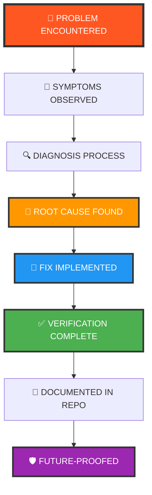

<div align="center">


```
██████╗ ███████╗██████╗  █████╗ ██╗██████╗     ██╗  ██╗██╗████████╗
██╔══██╗██╔════╝██╔══██╗██╔══██╗██║██╔══██╗    ██║ ██╔╝██║╚══██╔══╝
██████╔╝█████╗  ██████╔╝███████║██║██████╔╝    █████╔╝ ██║   ██║   
██╔══██╗██╔══╝  ██╔═══╝ ██╔══██║██║██╔══██╗    ██╔═██╗ ██║   ██║   
██║  ██║███████╗██║     ██║  ██║██║██║  ██║    ██║  ██╗██║   ██║   
╚═╝  ╚═╝╚══════╝╚═╝     ╚═╝  ╚═╝╚═╝╚═╝  ╚═╝    ╚═╝  ╚═╝╚═╝   ╚═╝   
```


### ⚡ *A Personal Archive of Real-World Problems & Verified Fixes* ⚡


---


### 💀 *"Every error. Every bug. Every crash. Logged. Solved. Documented forever."* 💀

### 🔥 *"The place where problems die and knowledge grows."* 🔥


</div>

---

## 🌟 What Is This?

<table>
<tr>
<td width="60%">

**repair-kit** is my personal engineering brain, externalized and archived in code.

This repository contains **every technical issue I have ever faced** (and will face) — spanning software, hardware, operating systems, networking, browsers, programming tools, and the infinite chaos that comes with being a developer. Each folder represents a **real problem I personally encountered**, diagnosed, and solved, complete with:

- 🔴 **Symptoms** — What broke and how it manifested
- 🔍 **Root Cause** — The actual underlying issue
- 🧪 **Diagnosis Steps** — How I isolated the problem
- 🔧 **Fix Steps** — The verified solution that worked
- ✅ **Verification** — How to confirm it's actually fixed
- 🛡️ **Prevention** — How to avoid it happening again

This isn't a collection of random fixes from the internet. Every entry here is **battle-tested, verified, and documented** from my own engineering experience.

</td>
<td width="40%">


### 📊 Quick Stats


</td>
</tr>
</table>

<div align="center">

### 💡 *Why does this exist?*

**Because I refuse to solve the same problem twice.**  
**Because debugging is a skill that improves with documentation.**  
**Because knowledge that isn't captured is knowledge that's lost.**

</div>

---

<div align="center">

## 🎯 Why This Repo Exists


</div>

<table>
<tr>
<td width="50%" align="center">

### 🧠 Knowledge Preservation


- ✅ **Never solve the same problem twice**
- ✅ Build a searchable long-term knowledge base
- ✅ Convert pain into wisdom
- ✅ Document context that disappears from memory
- ✅ Create a personal troubleshooting library

</td>
<td width="50%" align="center">

### 🚀 Engineering Growth


- ✅ **Improve systematic debugging skills**
- ✅ Track evolution as a developer
- ✅ Understand root causes deeply
- ✅ Build pattern recognition for failures
- ✅ Have a single source of truth for all fixes

</td>
</tr>
</table>

<div align="center">

```
╔══════════════════════════════════════════════════════════════════╗
║                                                                  ║
║  🎯 Document before you forget.                                  ║
║  🧠 Learn before you repeat.                                     ║
║  🔥 Fix once, reference forever.                                 ║
║                                                                  ║
╚══════════════════════════════════════════════════════════════════╝
```

</div>

---

<div align="center">

## 📁 Repository Structure


</div>

Each problem gets its own dedicated folder with complete documentation:

<table>
<tr>
<td width="50%">

```
📦 repair-kit/
┃
┣ 📂 chrome-not-loading/
┃ ┗ 📄 README.md
┃
┣ 📂 dns-corruption-issues/
┃ ┗ 📄 README.md
┃
┣ 📂 git-merge-conflict-hell/
┃ ┗ 📄 README.md
┃
┣ 📂 python-venv-broken/
┃ ┗ 📄 README.md
┃
┣ 📂 vpn-driver-conflicts/
┃ ┗ 📄 README.md
┃
┣ 📂 system-corruption/
┃ ┗ 📄 README.md
┃
┗ 📂 vscode-crash-loop/
  ┗ 📄 README.md
```

</td>
<td width="50%">

### 📋 Standard Documentation Format

Every issue folder follows this structure:

```markdown
# 🔴 Issue Title

## 🔴 Symptoms
What was broken and how it manifested

## 🎯 Root Cause
The actual underlying issue discovered

## 🔍 Diagnosis Steps
How I isolated and identified the problem

## 🔧 Fix Steps
Complete step-by-step solution

## ✅ Verification
How to confirm the fix worked

## 🛡️ Prevention (Optional)
How to avoid this in the future
```

</td>
</tr>
</table>

---

<div align="center">

## 🚀 How to Use This Repo


</div>

<table>
<tr>
<td width="50%">

### 🔍 For Future Me


**Finding Past Issues:**
```bash
# Search by keyword
grep -r "Chrome" */README.md

# Search by technology
grep -r "Python" */README.md

# Browse by folder names
ls -la
```

**Naming Conventions:**
- ✔️ Use descriptive, searchable names
- ✔️ Include technology/tool name
- ✔️ Use hyphens, not spaces
- ✔️ Keep it concise but clear

</td>
<td width="50%">

### ➕ Adding New Issues


**When documenting a new problem:**

1. 📁 Create a new folder with a clear name
2. 📝 Follow the standard format above
3. 🔍 Include all context and details
4. ❌ Document what DIDN'T work too
5. ✅ Add verification steps
6. 🛡️ Include prevention tips

**Maintenance:**
- 🔄 Update old issues if solutions improve
- 🔗 Add cross-references when relevant
- 🏷️ Tag issues by category/type
- 📋 Keep the main README updated

</td>
</tr>
</table>

---

<div align="center">

## 🔬 The Problem-Solving Flow


</div>



<div align="center">

### 🎯 *From Chaos to Clarity — Every Single Time*

</div>

---

<div align="center">

## ⚡ The Cyra Protocol™


### 🔥 *My Personal Systematic Debugging Methodology* 🔥

</div>

<table>
<tr>
<td width="50%">

### 🔍 Phase 1: Observation & Isolation


#### 1️⃣ **Reproduce**
- 🔄 Can I make it fail consistently?
- 📋 What are the exact conditions?
- 🎲 Does it happen every time or randomly?

#### 2️⃣ **Observe**
- 👁️ What exactly is broken?
- 💬 What error messages appear?
- 📊 What's the full context?

#### 3️⃣ **Isolate**
- ✅ What still works normally?
- 🔄 What changed recently?
- 🎯 Can I narrow down variables?

#### 4️⃣ **Test**
- 🧪 Does it work in a clean environment?
- ❌ Can I eliminate external factors?
- ⚙️ What happens with default settings?

</td>
<td width="50%">

### 🎯 Phase 2: Analysis & Resolution


#### 5️⃣ **Eliminate**
- 🚫 Rule out what it's NOT
- 🔬 Test one variable at a time
- 🧹 Remove red herrings systematically

#### 6️⃣ **Fix**
- 🔧 Apply targeted solution
- 🎯 Address the root cause, not symptoms
- 📝 Document what you're doing

#### 7️⃣ **Validate**
- ✅ Does it actually work now?
- 🔍 Did the fix break anything else?
- 🔄 Can I reproduce the success?

#### 8️⃣ **Document**
- 📄 Write it down immediately
- 🧠 Include full context and reasoning
- 🛡️ Add prevention tips

#### 9️⃣ **Future-proof**
- 🔮 How can I avoid this next time?
- 📚 What patterns did I learn?
- 💡 What should I remember?

</td>
</tr>
</table>

<div align="center">

```
╔══════════════════════════════════════════════════════════════════╗
║                    🔑 Core Debugging Principles 🔑                ║
╠══════════════════════════════════════════════════════════════════╣
║                                                                  ║
║  ⚡ Never assume. Always verify.                                 ║
║  🧠 Never cargo-cult. Always understand.                         ║
║  🎯 Never stop at symptoms. Always find root causes.             ║
║  📝 Never forget. Always document.                               ║
║                                                                  ║
╚══════════════════════════════════════════════════════════════════╝
```

</div>

---

<div align="center">

## 🛠️ Types of Problems Logged Here


</div>

<table>
<tr>
<td width="33%" align="center">

### 💻 Operating Systems


- 🪟 Windows corruption
- 🐧 Linux boot issues
- 🍎 macOS quirks
- 🔧 System updates gone wrong
- 📦 Driver conflicts
- ⚙️ Service failures

</td>
<td width="33%" align="center">

### 🌐 Networking & Web


- 🌍 Browser failures
- 🔒 VPN/Tunnel conflicts
- 📡 DNS corruption
- 🔌 Connection timeouts
- 🛡️ Firewall issues
- 🔐 SSL/TLS errors

</td>
<td width="33%" align="center">

### 🔧 Development Tools


- 🐍 Python environment chaos
- 📦 Package manager hell
- 🔗 Git disasters
- 💻 VS Code crashes
- 🐛 Debugger issues
- 🔨 Build tool failures

</td>
</tr>
<tr>
<td width="33%" align="center">

### 📊 Data & Algorithms


- ⚡ DSA problem patterns
- 🏆 Competitive programming pitfalls
- 🧮 Algorithm optimization
- 📈 Performance debugging
- 🎯 Logic errors
- 🔢 Edge case handling

</td>
<td width="33%" align="center">

### 🔐 Security & Auth


- 🔑 SSH key problems
- 🎫 OAuth failures
- 🔒 Permission denied errors
- 🔐 Certificate issues
- 🛂 Authentication loops
- 🔓 Token corruption

</td>
<td width="33%" align="center">

### 💥 The Unexplainable


- 👻 Random Windows gremlins
- 💾 Corrupted files
- 🎲 Inconsistent failures
- 🌀 Phantom errors
- 🔮 Mysterious crashes
- 🎪 "It worked yesterday" syndrome

</td>
</tr>
</table>

---

<div align="center">

## 🏆 Battle Stories & Highlights


### 🔥 *The Most Memorable Debugging Sessions* 🔥

</div>

<table>
<tr>
<td width="50%">

### 💀 **The Chrome Apocalypse**


**⏱️ 4 hours of debugging**

Internet worked perfectly. Every browser except Chrome loaded websites. Even IP addresses failed in Chrome. The culprit? Ghost VPN adapters hijacking Chromium's network stack.

**Severity:** 🔴 Catastrophic  
**Coffee Consumed:** ☕☕☕☕  
**Lessons:** Check virtual network adapters first

[](./chrome-not-loading/)

</td>
<td width="50%">

### ⚡ **The DNS Labyrinth**


**⏱️ 3 hours of confusion**

Websites resolved to wrong IPs. Flushing DNS didn't help. Browser cache was fine. The issue? Multi-layer cache corruption spanning Chrome, Windows, and router levels simultaneously.

**Severity:** 🟠 Complex  
**Coffee Consumed:** ☕☕☕  
**Lessons:** DNS has many cache layers

[](./dns-corruption-issues/)

</td>
</tr>
<tr>
<td width="50%">

### 🐍 **The Python Venv Nightmare**


**⏱️ 2 hours of frustration**

Virtual environment wouldn't activate. Pip commands failed. System Python was fine. The cause? Broken symlinks from a Windows system update that moved Python installation paths.

**Severity:** 🟡 Moderate  
**Coffee Consumed:** ☕☕  
**Lessons:** Always use absolute paths in venv

[](./python-venv-broken/)

</td>
<td width="50%">

### 💻 **The VS Code Extension War**


**⏱️ 1 hour of chaos**

VS Code crashed on startup. Safe mode worked. The problem? Two extensions fighting over keybindings created an infinite conflict loop during initialization.

**Severity:** 🟢 Simple  
**Coffee Consumed:** ☕  
**Lessons:** Disable half, test, repeat

[](./vscode-crash-loop/)

</td>
</tr>
</table>

---

<div align="center">

## 📊 Repository Statistics


</div>

<table align="center">
<tr>
<td align="center" width="25%">

### 📈 Total Solutions


</td>
<td align="center" width="25%">

### ⏱️ Avg Fix Time


</td>
<td align="center" width="25%">

### ✅ Success Rate


</td>
<td align="center" width="25%">

### 📚 Categories


</td>
</tr>
</table>

<div align="center">


</div>

---

<div align="center">

## 🎓 Learning Resources & Tools


</div>

<table>
<tr>
<td width="50%">

### 📚 Recommended Reading


- 📖 *The Practice of System and Network Administration* — Tom Limoncelli
- 📖 *Site Reliability Engineering* — Google SRE Book
- 📖 *Debugging: The 9 Indispensable Rules* — David Agans
- 📖 *Systems Performance* — Brendan Gregg
- 📖 *The Art of Troubleshooting* — Paul Venezia

</td>
<td width="50%">

### 🔧 Essential Debugging Tools


- 🛠️ **Sysinternals Suite** — Windows system utilities
- 🔍 **Wireshark** — Network protocol analyzer
- 📊 **Process Monitor** — Real-time system monitoring
- 🌐 **Chrome DevTools** — Browser debugging
- 🔀 **Git Bisect** — Finding commit bugs
- 🐧 **strace/ltrace** — System call tracing (Linux)

</td>
</tr>
</table>

---

<div align="center">

## 🤝 Contributing


</div>

This is my personal knowledge base, but if you've stumbled upon this and found it helpful:

<table align="center">
<tr>
<td align="center" width="33%">

### 🐛 Issues
Found an error or have a question?

[](https://github.com/cyra/repair-kit/issues)

</td>
<td align="center" width="33%">

### 💬 Discussions
Want to share your own solution?

[](https://github.com/cyra/repair-kit/discussions)

</td>
<td align="center" width="33%">

### 💡 Improvements
Better way to document something?

[](https://github.com/cyra/repair-kit/pulls)

</td>
</tr>
</table>

---

<div align="center">

## 📜 License


These are my personal troubleshooting notes, shared publicly in the hope they help someone avoid the same pain I went through.

**Use freely. Learn deeply. Debug systematically.**


</div>

---

<div align="center">

```
╔═══════════════════════════════════════════════════════════════════╗
║                                                                   ║
║  🔥 "Every bug fixed is a lesson learned.                         ║
║  💡 Every lesson documented is wisdom preserved.                  ║
║  ⚡ Every bit of wisdom preserved is power for the future."       ║
║                                                                   ║
║  This repository is my external brain — growing, evolving,        ║
║  and serving as proof that every problem has a solution.          ║
║                                                                   ║
╚═══════════════════════════════════════════════════════════════════╝
```

</div>

---

<div align="center">

## 💬 Final Words


</div>

This repo exists because **debugging is not just about fixing problems — it's about understanding systems deeply enough to prevent future problems.**

Every issue documented here represents hours of focused work, countless Google searches, dead ends explored, and finally, that moment of clarity when everything clicks. This is the archive of those moments.

<table>
<tr>
<td width="50%" align="center">

### 🔮 To Future Me


When you're stuck on a problem, remember that past you has probably already solved something similar. **Search this repo first.**

</td>
<td width="50%" align="center">

### 🌍 To Everyone Else


May you never face the same problems I did. But if you do, may these solutions guide you to victory faster than I found mine.

</td>
</tr>
</table>

---

<div align="center">

**Documented with precision, caffeine, and stubborn engineering**

**Cyra © 2025**

---


-FF9800?style=for-the-badge)


---

### 🌟 Show Your Support

If this repo helped you debug something faster, consider giving it a star!

[](https://github.com/cyra/repair-kit/stargazers)
[](https://github.com/cyra/repair-kit/fork)
[](https://github.com/cyra/repair-kit/subscription)

---

**⭐ Star this repo • 🔔 Watch for updates • 🤝 Share your debugging stories**

</div>


