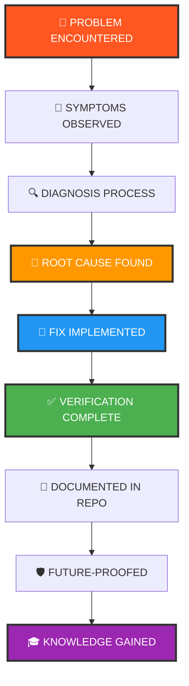

<div align="center">


```
██████╗ ███████╗██████╗  █████╗ ██╗██████╗     ██╗  ██╗██╗████████╗
██╔══██╗██╔════╝██╔══██╗██╔══██╗██║██╔══██╗    ██║ ██╔╝██║╚══██╔══╝
██████╔╝█████╗  ██████╔╝███████║██║██████╔╝    █████╔╝ ██║   ██║   
██╔══██╗██╔══╝  ██╔═══╝ ██╔══██║██║██╔══██╗    ██╔═██╗ ██║   ██║   
██║  ██║███████╗██║     ██║  ██║██║██║  ██║    ██║  ██╗██║   ██║   
╚═╝  ╚═╝╚══════╝╚═╝     ╚═╝  ╚═╝╚═╝╚═╝  ╚═╝    ╚═╝  ╚═╝╚═╝   ╚═╝   
```


# 🔥 THE LEGENDARY TROUBLESHOOTING ARCHIVE 🔥

### *"Every error. Every bug. Every crash. Logged. Solved. Documented forever."*


[](https://github.com/ArunVK/repair-kit)
[](https://github.com/ArunVK/repair-kit)
[](https://github.com/ArunVK/repair-kit/issues)


### 🎯 *"The place where problems die and knowledge grows."* 🎯

</div>

---

## 🌟 What Is This Legendary Repo?

<table>
<tr>
<td width="70%">

**repair-kit** is not your average documentation repo. This is **my engineering brain externalized** — a living, breathing archive of every technical battle fought and won.

This repository contains **every technical issue I have ever faced** (and will continue to face) — spanning software, hardware, operating systems, networking, browsers, programming tools, and the infinite chaos that comes with being a developer. Each folder represents a **real problem I personally encountered**, diagnosed, hunted down, and completely obliterated.

### 🎯 What Makes This Special?

- 🔴 **Real Problems** — Not theoretical. Not copy-pasted. Battle-tested.
- 🔍 **Deep Diagnostics** — Root cause analysis, not just quick fixes
- 🧪 **Verified Solutions** — Every fix is tested and validated
- 📚 **Complete Context** — Full story from symptom to resolution
- 🛡️ **Future-Proofed** — Prevention strategies included
- ⚡ **Always Growing** — New battles, new victories, new knowledge

</td>
<td width="30%" align="center">


### 📊 Quick Stats


</td>
</tr>
</table>

---

<div align="center">

## 🎨 Why This Repo Exists


</div>

<table>
<tr>
<td width="50%" align="center">

### 🧠 Knowledge Preservation


- ✨ **Never solve the same problem twice**
- 📚 Build a searchable knowledge base
- 🔄 Convert pain into wisdom
- 💾 Document context before it fades
- 🎯 Create a personal troubleshooting library

</td>
<td width="50%" align="center">

### 🚀 Engineering Growth


- 📈 **Improve systematic debugging skills**
- 🏆 Track evolution as a developer
- 🎓 Understand root causes deeply
- 🔮 Build pattern recognition for failures
- 💡 Have a single source of truth

</td>
</tr>
</table>

<div align="center">

```ascii
╔══════════════════════════════════════════════════════════════╗
║                                                              ║
║     💡 "Document before you forget.                          ║
║         Learn before you repeat.                             ║
║         Fix once, reference forever."                        ║
║                                                              ║
╚══════════════════════════════════════════════════════════════╝
```

</div>

---

<div align="center">

## 📁 Repository Structure


</div>

Each problem gets its own dedicated folder with complete documentation:

<table>
<tr>
<td width="50%">

### 🗂️ Folder Organization

```
📦 repair-kit/
┣ 🔥 chrome-not-loading/
┃ ┗ 📄 README.md
┣ 🌐 dns-corruption-issues/
┃ ┗ 📄 README.md
┣ 🔗 git-merge-conflict-hell/
┃ ┗ 📄 README.md
┣ 🐍 python-venv-broken/
┃ ┗ 📄 README.md
┣ 💥 vpn-driver-conflicts/
┃ ┗ 📄 README.md
┣ 💻 system-corruption/
┃ ┗ 📄 README.md
┣ ⚡ vscode-crash-loop/
┃ ┗ 📄 README.md
┗ 📄 README.md (you are here)
```

</td>
<td width="50%">

### 📋 Standard Documentation Format


```markdown
# Issue Title

## 🔴 Symptoms
What was broken and how

## 🎯 Root Cause
The actual problem

## 🔍 Diagnosis Steps
How I found it

## 🔧 Fix Steps
Complete solution

## ✅ Verification
How to confirm

## 🛡️ Prevention
Avoid it next time
```

</td>
</tr>
</table>

---

<div align="center">

## 🚀 How to Use This Repo


</div>

<table>
<tr>
<td width="50%">

### 🔍 For Future Me (And You)


**Finding Past Issues:**

```bash
# Search by keyword
grep -r "Chrome" */README.md

# Search by technology
grep -r "Python" */README.md

# Search by symptom
grep -r "crash" */README.md

# Browse all issues
ls -la
```

**Naming Conventions:**
- ✅ Descriptive, searchable names
- ✅ Include technology/tool name
- ✅ Use hyphens, not spaces
- ✅ Keep it concise but clear

</td>
<td width="50%">

### ➕ Adding New Issues


**When documenting a new problem:**

1. 📁 Create a new folder with clear name
2. 📝 Follow the standard format
3. 🔍 Include all context and details
4. ❌ Document what DIDN'T work
5. ✅ Add verification steps
6. 🛡️ Include prevention tips

**Maintenance:**
- 🔄 Update old issues if solutions improve
- 🔗 Add cross-references when relevant
- 🏷️ Tag issues by category/type
- 📊 Keep the main README updated

</td>
</tr>
</table>

---

<div align="center">

## 🔬 The Problem-Solving Flow


</div>



---

<div align="center">

## ⚡ The Personal Debugging Protocol™


### *My Personal Systematic Debugging Methodology*


</div>

<table>
<tr>
<td width="50%">

### 🎯 Phase 1: Observation & Isolation


#### 1️⃣ **Reproduce**
- 🔄 Can I make it fail consistently?
- 📋 What are the exact conditions?
- ⏰ Does it happen every time or randomly?

#### 2️⃣ **Observe**
- 👀 What exactly is broken?
- 💬 What error messages appear?
- 🌍 What's the full context?

#### 3️⃣ **Isolate**
- ✅ What still works normally?
- 🔄 What changed recently?
- 🎯 Can I narrow down variables?

#### 4️⃣ **Test**
- 🧪 Does it work in a clean environment?
- 🚫 Can I eliminate external factors?
- ⚙️ What happens with default settings?

</td>
<td width="50%">

### 🔧 Phase 2: Analysis & Resolution


#### 5️⃣ **Eliminate**
- ❌ Rule out what it's NOT
- 🔬 Test one variable at a time
- 🎯 Remove red herrings systematically

#### 6️⃣ **Fix**
- 🔧 Apply targeted solution
- 🎯 Address root cause, not symptoms
- 📝 Document what you're doing

#### 7️⃣ **Validate**
- ✅ Does it actually work now?
- 🔍 Did the fix break anything else?
- 🔄 Can I reproduce the success?

#### 8️⃣ **Document**
- 📝 Write it down immediately
- 🌍 Include full context and reasoning
- 🛡️ Add prevention tips

#### 9️⃣ **Future-proof**
- 🔮 How can I avoid this next time?
- 📚 What patterns did I learn?
- 🧠 What should I remember?

</td>
</tr>
</table>

<div align="center">

### 🔑 Core Debugging Principles


</div>

---

<div align="center">

## 🛠️ Types of Problems Logged Here


</div>

<table>
<tr>
<td width="33%" align="center">

### 💻 Operating Systems


- 🪟 Windows corruption
- 🐧 Linux boot issues
- 🍎 macOS quirks
- 🔧 System updates gone wrong
- 📦 Driver conflicts
- ⚙️ Service failures


</td>
<td width="33%" align="center">

### 🌐 Networking & Web


- 🌍 Browser failures
- 🔒 VPN/Tunnel conflicts
- 📡 DNS corruption
- 🔌 Connection timeouts
- 🛡️ Firewall issues
- 🔐 SSL/TLS errors


</td>
<td width="33%" align="center">

### 🔧 Development Tools


- 🐍 Python environment chaos
- 📦 Package manager hell
- 🔗 Git disasters
- 💻 VS Code crashes
- 🐛 Debugger issues
- 🔨 Build tool failures


</td>
</tr>
<tr>
<td width="33%" align="center">

### 📊 Data & Algorithms


- ⚡ DSA problem patterns
- 🏆 Competitive programming
- 🧮 Algorithm optimization
- 📈 Performance debugging
- 🎯 Logic errors
- 🔢 Edge case handling


</td>
<td width="33%" align="center">

### 🔐 Security & Auth


- 🔑 SSH key problems
- 🎫 OAuth failures
- 🔒 Permission denied
- 🔐 Certificate issues
- 🛂 Authentication loops
- 🔓 Token corruption


</td>
<td width="33%" align="center">

### 💥 The Unexplainable


- 👻 Random gremlins
- 💾 Corrupted files
- 🎲 Inconsistent failures
- 🌀 Phantom errors
- 🔮 Mysterious crashes
- 🎪 "Worked yesterday"


</td>
</tr>
</table>

---

<div align="center">

## 🏆 Battle Stories & Highlights


### *The Most Epic Debugging Sessions*

</div>

<table>
<tr>
<td width="50%">

### 🔥 **The Chrome Apocalypse**


**⏱️ Duration:** 4 hours of pure chaos  
**🔴 Severity:** Catastrophic  
**🎯 Root Cause:** Ghost VPN adapters

Internet worked perfectly. Every browser except Chrome loaded websites. Even IP addresses failed. The culprit? Virtual network adapters hijacking Chromium's network stack after VPN uninstall.

**💡 Lessons Learned:**
- Check virtual adapters first
- VPN uninstallers leave ghosts
- Chrome has its own network stack

[](./chrome-not-loading/)

</td>
<td width="50%">

### ⚡ **The DNS Labyrinth**


**⏱️ Duration:** 3 hours of confusion  
**🟠 Severity:** Complex  
**🎯 Root Cause:** Multi-layer cache corruption

Websites resolved to wrong IPs. Flushing DNS didn't help. Browser cache was fine. The issue? Corruption spanning Chrome, Windows, AND router levels simultaneously.

**💡 Lessons Learned:**
- DNS has many cache layers
- Flush at every level
- Router cache exists too

[](./dns-corruption-issues/)

</td>
</tr>
<tr>
<td width="50%">

### 🐍 **The Python Venv Nightmare**


**⏱️ Duration:** 2 hours of frustration  
**🟡 Severity:** Moderate  
**🎯 Root Cause:** Broken symlinks

Virtual environment wouldn't activate. Pip failed. System Python was fine. The cause? Windows update moved Python paths and broke all symlinks in venv.

**💡 Lessons Learned:**
- Always use absolute paths
- Venv are fragile to moves
- Recreate after system updates

[](./python-venv-broken/)

</td>
<td width="50%">

### 💻 **The VS Code Extension War**


**⏱️ Duration:** 1 hour of chaos  
**🟢 Severity:** Simple  
**🎯 Root Cause:** Extension conflict

VS Code crashed on startup. Safe mode worked fine. The problem? Two extensions fighting over the same keybindings created an infinite conflict loop during initialization.

**💡 Lessons Learned:**
- Disable half, test, repeat
- Check extension conflicts
- Safe mode is your friend

[](./vscode-crash-loop/)

</td>
</tr>
</table>

---

<div align="center">

## 📊 Repository Statistics Dashboard


</div>

<table align="center">
<tr>
<td align="center" width="25%">

### 📈 Issues Solved

**And Counting**

</td>
<td align="center" width="25%">

### ⏱️ Avg Fix Time

**Per Issue**

</td>
<td align="center" width="25%">

### ✅ Success Rate

**Never Give Up**

</td>
<td align="center" width="25%">

### 📚 Categories

**Covered**

</td>
</tr>
<tr>
<td align="center" width="25%">

### ☕ Coffee Consumed

**Fuel**

</td>
<td align="center" width="25%">

### 🕐 Hours Debugging

**But Worth It**

</td>
<td align="center" width="25%">

### 📈 Knowledge Gained

**Growth**

</td>
<td align="center" width="25%">

### 🔥 Bugs Squashed

**RIP Bugs**

</td>
</tr>
</table>

---

<div align="center">

## 🎓 Learning Resources & Essential Tools


</div>

<table>
<tr>
<td width="50%">

### 📚 Recommended Reading


- 📘 *The Practice of System and Network Administration*
- 📗 *Site Reliability Engineering (Google SRE Book)*
- 📕 *Debugging: The 9 Indispensable Rules*
- 📙 *Systems Performance* by Brendan Gregg
- 📓 *The Art of Troubleshooting*

[](https://github.com/ArunVK/repair-kit)

</td>
<td width="50%">

### 🔧 Essential Debugging Tools


- 🛠️ **Sysinternals Suite** — Windows utilities
- 🦈 **Wireshark** — Network analysis
- 📊 **Process Monitor** — System monitoring
- 🔍 **Chrome DevTools** — Browser debugging
- 🔄 **Git Bisect** — Finding commit bugs
- 🔬 **strace/ltrace** — System call tracing

[](https://github.com/ArunVK/repair-kit)

</td>
</tr>
</table>

---

<div align="center">

## 🤝 Contributing & Community


</div>

<table>
<tr>
<td align="center" width="33%">

### 🐛 Found an Issue?


Spotted an error or have a question?

[](https://github.com/ArunVK/repair-kit/issues)

</td>
<td align="center" width="33%">

### 💬 Start Discussion


Want to share your own solution?

[](https://github.com/ArunVK/repair-kit/discussions)

</td>
<td align="center" width="33%">

### ✨ Suggest Improvement


Better way to document?

[](https://github.com/ArunVK/repair-kit/issues/new)

</td>
</tr>
</table>

---

<div align="center">

## 📜 License


</div>

**© 2025 Arun VK. All Rights Reserved.**

These are my personal troubleshooting notes, shared publicly in the hope they help someone avoid the same pain I went through. While the content is shared for educational purposes, all rights to this repository and its contents belong to Arun VK.

**Use freely for learning. Credit appropriately. Debug systematically.**

Feel free to reference, adapt, or learn from anything here. If it helps you solve your problem faster, that's a win. If you use or reference this work, please provide appropriate attribution.

[](LICENSE)

---

<div align="center">

```ascii
╔═══════════════════════════════════════════════════════════════════╗
║                                                                   ║
║  "Every bug fixed is a lesson learned.                            ║
║   Every lesson documented is wisdom preserved.                    ║
║   Every bit of wisdom preserved is power for the future."         ║
║                                                                   ║
║  This repository is my external brain — growing, evolving,        ║
║  and serving as proof that every problem has a solution.          ║
║                                                                   ║
╚═══════════════════════════════════════════════════════════════════╝
```

### 💬 Final Words


This repo exists because **debugging is not just about fixing problems — it's about understanding systems deeply enough to prevent future problems.**

Every issue documented here represents hours of focused work, countless Google searches, dea
